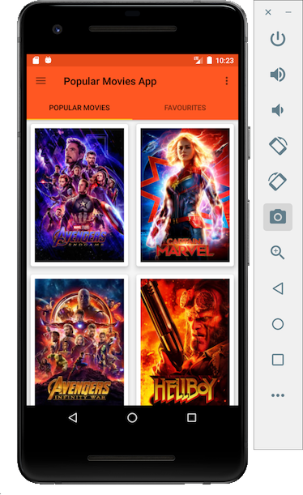
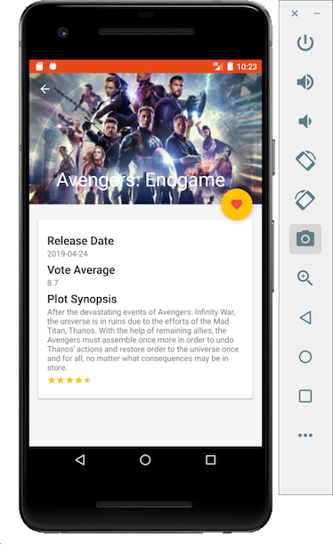

# Popular Movies App
This is a sample app to demonstrate various Android Jetpack Library apis. 

Introduction
------------

Android Jetpack is a set of components, tools and guidance to make great Android apps. They bring
together the existing Support Library and Architecture Components and arranges them into four
categories:

Popular Movies Android app is using the material design with support library and design library.

The data is coming [from moviedb.org](https://www.themoviedb.org/) using the [discover apis](https://www.themoviedb.org/documentation/api).

It  is a basis to learn the android support library for design and the new [Android Architecture Component](https://developer.android.com/topic/libraries/architecture/index.html).

 

## The Android Apis used:
This project mainly is concerned with [Android Architecture Component](https://developer.android.com/topic/libraries/architecture/index.html) as a whole.
* [Lifecycle Components](https://developer.android.com/topic/libraries/architecture/lifecycle.html) - These components provide constructs to tie core components to android lifecycle events.
* [LiveData](https://developer.android.com/topic/libraries/architecture/livedata.html) - Is an observable lifecycle-aware data holder class.
* [ViewModel](https://developer.android.com/topic/libraries/architecture/viewmodel.html) - Is a helper class that contains UI data for activity or fragment to separate view logic from controller logic.
* [Data Persistence](https://developer.android.com/topic/libraries/architecture/room.html) - This is a [Room Library](https://developer.android.com/topic/libraries/architecture/room.html) to simplify sqlite with object-mapping abstraction layer.

Getting Started
---------------
This project uses the Gradle build system. To build this project, use the
`gradlew build` command or use "Import Project" in Android Studio.

There are two Gradle tasks for testing the project:
* `connectedAndroidTest` - for running Espresso on a connected device
* `test` - for running unit tests

For more resources on learning Android development, visit the
[Developer Guides](https://developer.android.com/guide/) at
[developer.android.com](https://developer.android.com).

Libraries Used
--------------
* [Foundation][0] - Components for core system capabilities, Kotlin extensions and support for
  multidex and automated testing.
  * [AppCompat][1] - Degrade gracefully on older versions of Android.
  * [Android KTX][2] - Write more concise, idiomatic Kotlin code.
  * [Test][4] - An Android testing framework for unit and runtime UI tests.
* [Architecture][10] - A collection of libraries that help you design robust, testable, and
  maintainable apps. Start with classes for managing your UI component lifecycle and handling data
  persistence.
  * [Data Binding][11] - Declaratively bind observable data to UI elements.
  * [Lifecycles][12] - Create a UI that automatically responds to lifecycle events.
  * [LiveData][13] - Build data objects that notify views when the underlying database changes.
  * [Navigation][14] - Handle everything needed for in-app navigation.
  * [Room][16] - Access your app's SQLite database with in-app objects and compile-time checks.
  * [ViewModel][17] - Store UI-related data that isn't destroyed on app rotations. Easily schedule
     asynchronous tasks for optimal execution.
  * [WorkManager][18] - Manage your Android background jobs.
* [UI][30] - Details on why and how to use UI Components in your apps - together or separate
  * [Animations & Transitions][31] - Move widgets and transition between screens.
  * [Fragment][34] - A basic unit of composable UI.
  * [Layout][35] - Lay out widgets using different algorithms.
* Third party
  * [Glide][90] for image loading
  * [Kotlin Coroutines][91] for managing background threads with simplified code and reducing needs for callbacks

[0]: https://developer.android.com/jetpack/foundation/
[1]: https://developer.android.com/topic/libraries/support-library/packages#v7-appcompat
[2]: https://developer.android.com/kotlin/ktx
[4]: https://developer.android.com/training/testing/
[10]: https://developer.android.com/jetpack/arch/
[11]: https://developer.android.com/topic/libraries/data-binding/
[12]: https://developer.android.com/topic/libraries/architecture/lifecycle
[13]: https://developer.android.com/topic/libraries/architecture/livedata
[14]: https://developer.android.com/topic/libraries/architecture/navigation/
[16]: https://developer.android.com/topic/libraries/architecture/room
[17]: https://developer.android.com/topic/libraries/architecture/viewmodel
[18]: https://developer.android.com/topic/libraries/architecture/workmanager
[30]: https://developer.android.com/jetpack/ui/
[31]: https://developer.android.com/training/animation/
[34]: https://developer.android.com/guide/components/fragments
[35]: https://developer.android.com/guide/topics/ui/declaring-layout
[90]: https://bumptech.github.io/glide/
[91]: https://kotlinlang.org/docs/reference/coroutines-overview.html

Non-Goals
---------
The focus of this project is on Android Jetpack and the Android framework.
Thus, there are no immediate plans to implement features outside of this scope.
for DI, there are no plans to incorporate DI into Popular Movies App.  
This allows developers unfamiliar with dependency injection to better 
understand Popular Movies code without having to learn DI.

